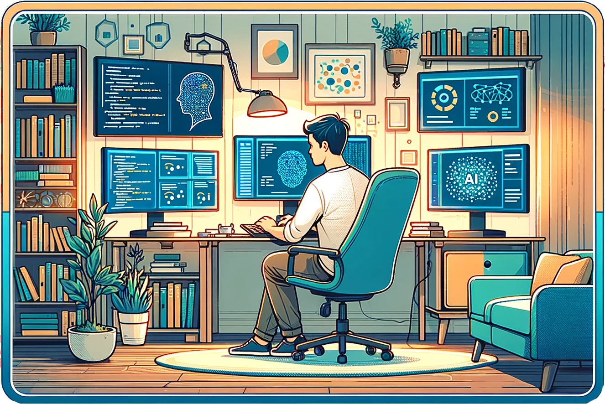

<h2> Hi, I'm Cornelius Wolff</h2>

<em>Junior Researcher at the <a href="https://www.dfki.de/en/web" target="_blank">German Research Centre for AI</a> Research Assistant at <a href="https://ikw.uni-osnabrueck.de/en/home.html" target="_blank">Institute of Cognitive Science Osnabrück</a> and founder of the EBIMAS study project within the <a href="https://microcosm.ai/teaching-courses/" target="_blank">Microcosm project</a> Writing my master thesis at <a href="https://eliabruni.github.io/" target="_blank">Lab of Prof. Elia Bruni</a> Developing little AI tools such as the <a href="https://ailluminator.com/" target="_blank">AI/lluminator</a> science tracker in my free time Member of the <a href="https://musslick.github.io/AER_website/" target="_blank"> Autonomous Empirical Research Group</a></em>

 

<em> <a href="https://scholar.google.com/citations?user=Y8xr0JgAAAAJ" target="_blank">My Google Scholar Feed</a></em>

## Life
- Grew up all over the place in Germany
- Did my Bachelor in Information Systems
- Research Assistant at Prof. Aschenbrucks' Lab at Osnabrück University
- Research Assistant at Prof. Brunis' Lab at Osnabrück University
- Master in Cognitive Science
- Junior Researcher at the DFKI

## My GitHub Stats

## Connect with me:

